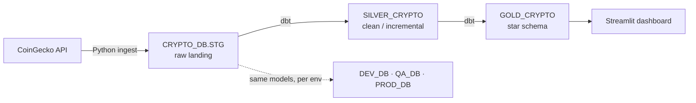
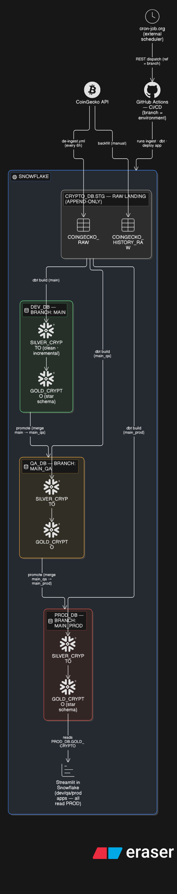

# Crypto Market Data Pipeline (`coin-dwh-ml`)

A production-style, end-to-end **data engineering pipeline** for daily cryptocurrency market data:
**CoinGecko API → Snowflake (medallion → star schema) → dbt → Streamlit dashboard**, fully automated with GitHub Actions and promoted across **dev / qa / prod** environments.

> **Detailed setup & run guide:** [`de-pipeline/README.md`](./de-pipeline/README.md) — everything below is the summary.
> Full design rationale: [`.claude/crypto-de-pipeline-project-plan.md`](./.claude/crypto-de-pipeline-project-plan.md).




## What it's for

Ingest a curated set of coins (top market-cap coins + major stablecoins) from CoinGecko every few hours, land the raw data once in Snowflake, transform it into a clean, tested analytics warehouse (daily prices, returns, market snapshots), and expose it through a Streamlit dashboard — all running on a schedule with no manual steps, and safely promoted from **dev → qa → prod**.

## Tools & technology

| Area | Used |
|---|---|
| **Source** | CoinGecko REST API (keyless + optional Pro key) |
| **Ingestion** | Python (`requests`, `snowflake-connector-python`, key-pair auth) |
| **Warehouse** | Snowflake — warehouses, 4 databases, schemas, **Streams & Tasks**, key-pair (`TYPE=SERVICE`) auth |
| **Transformation** | **dbt Core** (`dbt-snowflake`, `dbt_utils`) — models, snapshots, tests |
| **Dashboard** | **Streamlit in Snowflake** + Altair |
| **CI/CD** | **GitHub Actions**, `sqlfluff` (SQL linting), branch-per-environment |
| **Scheduling** | **cron-job.org** (external cron via the GitHub REST API) |

## Data engineering techniques

- **Medallion architecture** — Bronze (raw landing) → Silver (clean/typed/deduped) → Gold (analytics).
- **Star schema** — conformed dimensions + fact tables with surrogate **PK**s and **FK** relationships.
- **SCD Type 2** — coin attribute history via a dbt snapshot + range-join into the facts.
- **Incremental models** — merge only new rows on a watermark; append-only landing tables for a full audit trail.
- **Data quality as tests** — `not_null` / `unique` / `relationships` / range tests gate every build.
- **Environment isolation** — the *same* models build into `DEV_DB` / `QA_DB` / `PROD_DB` by dbt `--target`.
- **Idempotent, version-controlled infra** — all Snowflake objects defined as re-runnable SQL, applied by CI.
- **Secrets & least privilege** — key-pair service account, no passwords in the repo, narrow data-plane role.

## How automation & CI/CD work

**Branch = environment.** `main` → dev, `main_qa` → qa, `main_prod` → prod. Each environment runs the code **frozen on its branch**; you promote by merging forward (`main → main_qa → main_prod`), so a dev change never leaks into prod until it's deliberately promoted.

Work reaches Snowflake three ways:

- **On code change (CI/CD).** PRs run `sqlfluff` (SQL) and `dbt build` + tests; merges apply infra SQL / rebuild that branch's environment.
- **On schedule.** GitHub's built-in cron is unreliable, so **cron-job.org** dispatches each workflow via the REST API — the branch in the request (`ref`) selects the environment. Runs are staggered: ingest → dev → qa → prod.
- **Manual.** Every workflow has a **Run workflow** button.

Workflows (`.github/workflows/`): `infra-ci` / `infra-deploy` (Snowflake objects), `de-ingest` / `de-ingest-history` (data in), `dbt-run` (dev) / `dbt-promote` (qa+prod), `streamlit-deploy` (dashboard). Promotion can be gated by **branch protection** and **GitHub Environment** reviewers.

## Setting up on a new Snowflake account (e.g. after a trial expires)

The whole platform is code, so standing up a **fresh Snowflake account takes ~10 minutes** — no click-ops. In short:

1. Generate an RSA key pair (`openssl`).
2. Paste one bootstrap SQL block into a Snowsight worksheet as `ACCOUNTADMIN` (creates the `DEVELOPER_SVC` key-pair service account + a few account grants).
3. Add three GitHub Actions secrets (`SNOWFLAKE_ACCOUNT`, `SNOWFLAKE_DEV_SVC_USER`, `SNOWFLAKE_DEV_SVC_PRIVATE_KEY`).
4. Run the **Infra Deploy** workflow — it creates the warehouse, all databases/schemas, landing tables, and roles.

Then create the `main_qa` / `main_prod` branches and wire the cron-job.org schedules, and it's live.
**Full copy-paste walkthrough:** [`de-pipeline/README.md` → Quickstart](./de-pipeline/README.md#quickstart--stand-up-a-new-snowflake-account-10-minutes).

## Repository layout

```
.github/workflows/   CI/CD (infra, ingest, dbt dev/promote, streamlit)
de-pipeline/
  ingestion/         Python CoinGecko ingestion + historical backfill
  dbt/               dbt project — silver/gold models, snapshot, tests
  snowflake/         setup SQL, streams/tasks, Streamlit app + deploy
  README.md          ← detailed setup & run guide
.claude/             project design doc
```

## Documentation

- **Setup & run guide (start here):** [`de-pipeline/README.md`](./de-pipeline/README.md)
- **Design doc / rationale:** [`.claude/crypto-de-pipeline-project-plan.md`](./.claude/crypto-de-pipeline-project-plan.md)
.md)