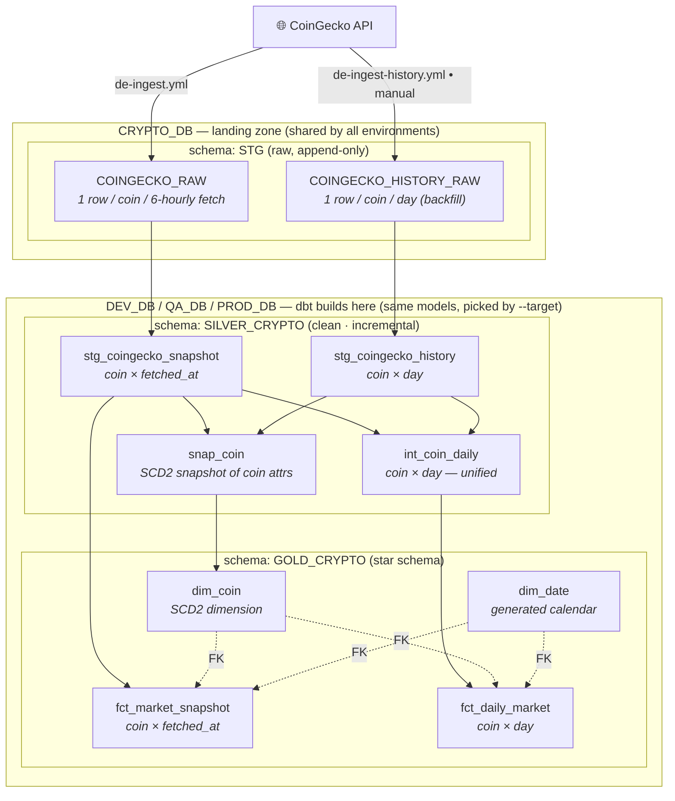
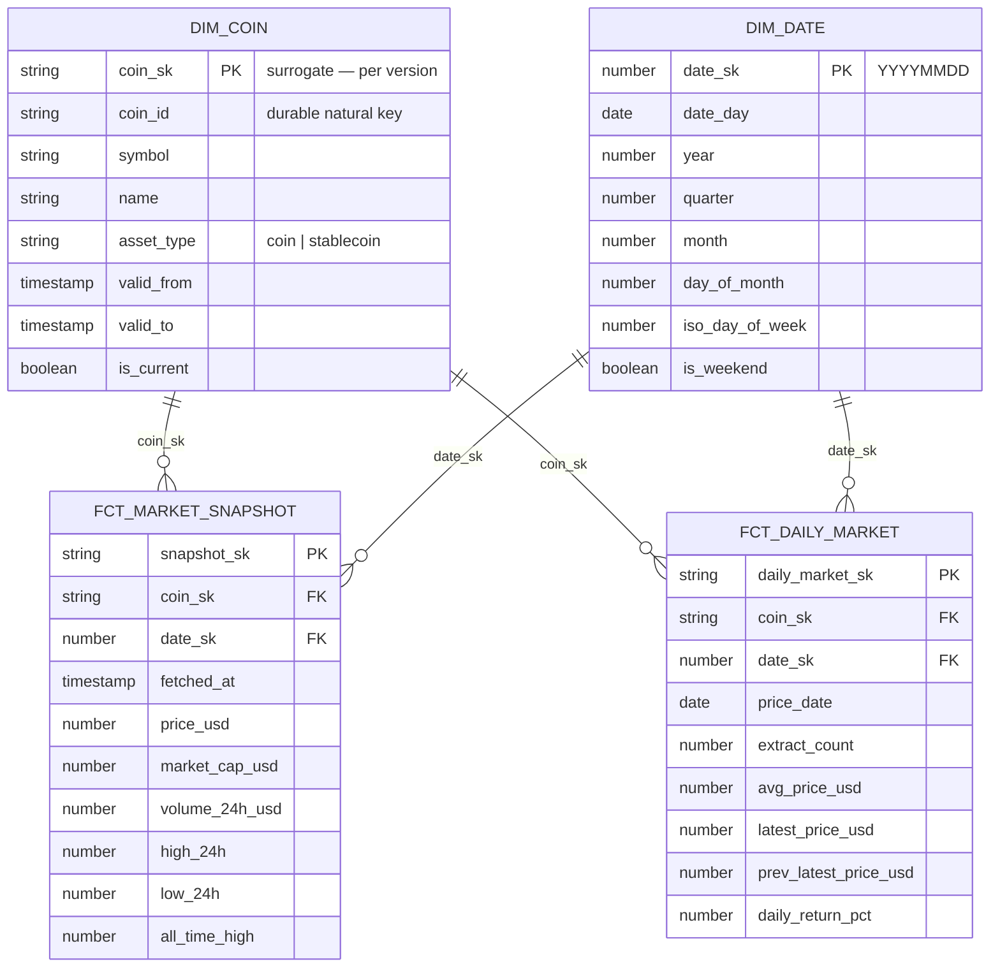

# Crypto Market Pipeline

Daily crypto market data pipeline: CoinGecko → Snowflake (landing → dev/qa/prod via dbt) → GitHub Actions.

[`Full design doc`](../.claude/crypto-de-pipeline-project-plan.md).

---

## Overview

Data flows **CoinGecko API → `CRYPTO_DB.STG` (Snowflake landing zone) → dbt medallion (Silver → Gold star schema) → `DEV_DB` / `QA_DB` / `PROD_DB`**, all orchestrated by GitHub Actions. Raw data lands once in the shared `CRYPTO_DB.STG`; dbt then builds an independent copy of the warehouse into each environment database by re-running the *same* models with a different `--target`.

The workflows in [`.github/workflows/`](../.github/workflows/):

| Workflow | Does | Triggered by |
|---|---|---|
| `infra-ci.yml` | `sqlfluff` parse of `snowflake/**` | PR |
| `infra-deploy.yml` | apply `setup.sql` / `streams.sql` / `tasks.sql` to Snowflake | merge to `main` + manual |
| `de-ingest.yml` | ingest CoinGecko snapshot → `CRYPTO_DB.STG` | external cron (cron-job.org) + manual |
| `de-ingest-history.yml` | one-off historical backfill | manual only |
| `dbt-run.yml` | build + test dbt into `DEV_DB` | PR + merge + external cron |
| `dbt-promote.yml` | build `QA_DB` **or** `PROD_DB` (chosen by `target` input) | external cron (one job per env) + manual |
| `dbt-snowflake.yml` | Snowflake-native dbt (Step 5a) — **disabled**, needs a billed account | — |

Two Snowflake identities: **`DEVELOPER_SVC`** (a `TYPE=SERVICE` key-pair account, `SYSADMIN`+`USERADMIN`) is what every CI workflow authenticates as; **`CRYPTO_PIPELINE_ROLE`** is a narrower data-plane role used only for optional local password auth.

## Data flow — databases, schemas & tables

Raw data lands **once** in the shared `CRYPTO_DB.STG`; dbt then builds the **same** Silver → Gold models into whichever environment database the `--target` points at (`DEV_DB` / `QA_DB` / `PROD_DB`), each an independent copy. Two Python feeds fill the landing zone: the 6-hourly market **snapshot** and a manual daily-**history** backfill.



**Layers at a glance** (`*` = `DEV_DB` / `QA_DB` / `PROD_DB` — identical objects per environment):

| Layer — `database.schema` | Object | Grain (1 row per…) | Built as |
|---|---|---|---|
| **Bronze** — `CRYPTO_DB.STG` | `COINGECKO_RAW` | coin × 6-hourly fetch | landing table (append-only) — from `ingest_coingecko.py` |
| | `COINGECKO_HISTORY_RAW` | coin × day | landing table (append-only) — from `backfill_coingecko_history.py` |
| **Silver** — `*.SILVER_CRYPTO` | `stg_coingecko_snapshot` | coin × fetched_at | incremental (clean/typed/dedup of `COINGECKO_RAW`) |
| | `stg_coingecko_history` | coin × day | incremental (clean/typed/dedup of `COINGECKO_HISTORY_RAW`) |
| | `int_coin_daily` | coin × day | incremental — unifies both feeds; per day keeps **avg across extracts** + **latest extract** + `extract_count` (snapshot wins over history) |
| | `snap_coin` | coin *version* | dbt snapshot — SCD Type-2 on `symbol`/`name`/`asset_type` |
| **Gold** — `*.GOLD_CRYPTO` | `dim_coin` | coin *version* | table — SCD2 dimension from `snap_coin` |
| | `dim_date` | calendar day | table — generated `date_spine` (not from raw) |
| | `fct_market_snapshot` | coin × fetched_at | incremental fact (intraday detail) |
| | `fct_daily_market` | coin × day | incremental fact (daily series + day-over-day return) |

### Gold star schema (keys)

Both facts carry surrogate **PK**s and resolve `coin_sk` by an SCD2 **range join** to `dim_coin` (the coin version whose `[valid_from, valid_to)` contains the event) and `date_sk` to `dim_date`.



## How the deployment flow runs (after setup)

Once the one-time setup below is done, the pipeline runs itself. Work reaches Snowflake three ways:

**A. Scheduled (production) — external cron via cron-job.org.** GitHub's built-in `schedule:` is delayed/dropped under load and only fires from the default branch, so instead cron-job.org POSTs to each workflow's REST dispatch endpoint on time (set directly in Bangkok time). The daily flow is staggered so each stage's inputs have landed:

```
08:00  de-ingest.yml    →  CoinGecko snapshot → CRYPTO_DB.STG.COINGECKO_RAW   (repeats every 6h)
08:30  dbt-run.yml      →  dbt build --target dev   → DEV_DB    (Silver + Gold + tests)
09:00  dbt-promote.yml  →  dbt build --target qa    → QA_DB     (gated by "qa" reviewers, if set)
10:00  dbt-promote.yml  →  dbt build --target prod  → PROD_DB   (gated by "prod" reviewers, if set)
```

The stages are independent workflows (no hard `needs:` across them) — the stagger is a loose coupling, not a dependency. Because Silver/Gold are incremental, a late or missed upstream run just means that cycle merges fewer new rows rather than breaking.

**B. On code change — GitHub-native CI/CD (PR + merge to `main`).**

| You do | GitHub runs |
|---|---|
| Open a PR touching `de-pipeline/snowflake/**` | `infra-ci.yml` — `sqlfluff` parse (no credentials) |
| Merge to `main` touching `de-pipeline/snowflake/**` | `infra-deploy.yml` — apply the SQL to Snowflake |
| Open a PR touching `de-pipeline/dbt/**` | `dbt-run.yml` **ci** — `dbt build` + tests on `DEV_DB` |
| Merge to `main` touching `de-pipeline/dbt/**` | `dbt-run.yml` **deploy-dev** — rebuild `DEV_DB` |

**C. Manual — any time.** Every workflow has a **Run workflow** button (**GitHub repo → Actions → _workflow_ → Run workflow**); for `dbt-promote.yml` pick the `qa` or `prod` target from the dropdown. Ingestion and dbt also run locally (sections 2–3).

> **Promotion gates:** QA/PROD builds pause for a manual **Approve** click only if you add Required Reviewers to the `qa` / `prod` GitHub Environments (section 4.2). With no reviewers, they run straight through.

## Quickstart — stand up a new Snowflake account (~10 minutes)

Do these in order. **Steps 1–4 stand the platform up** (~5 min, copy-paste); **steps 5–6 turn on automation.** Each step is expanded in the numbered sections further down.

**Prerequisites:** `openssl` (ships with Git for Windows), **Python 3.11+**, this repo pushed to your own GitHub `main`, a Snowflake account you can log into as **`ACCOUNTADMIN`**, and a free [cron-job.org](https://cron-job.org) account (for scheduling in step 6).

### Step 1 — Generate the service-account key pair · _detail: §1.1_

From the `de-pipeline/` folder:

```bash
mkdir -p .keys && cd .keys
openssl genrsa 2048 | openssl pkcs8 -topk8 -inform PEM -out rsa_key.p8 -nocrypt   # private key (never commit)
openssl rsa -in rsa_key.p8 -pubout -out rsa_key.pub                               # public key (goes to Snowflake)
```

### Step 2 — Bootstrap Snowflake (once, as `ACCOUNTADMIN`) · _detail: §1.2_

Paste into a Snowsight worksheet. Put the **body** of `rsa_key.pub` (drop the `BEGIN/END` lines and newlines) into `RSA_PUBLIC_KEY`. This is the **only** thing you run by hand in Snowflake — `infra-deploy.yml` (step 4) builds everything else.

```sql
USE ROLE ACCOUNTADMIN;

CREATE USER IF NOT EXISTS DEVELOPER_SVC
  TYPE = SERVICE
  RSA_PUBLIC_KEY = '<paste rsa_key.pub body here>'
  DEFAULT_ROLE = SYSADMIN
  DEFAULT_WAREHOUSE = CRYPTO_WH
  COMMENT = 'Infra CI/CD service account (key-pair auth)';

GRANT ROLE SYSADMIN  TO USER DEVELOPER_SVC;   -- build warehouses / databases / schemas / tables
GRANT ROLE USERADMIN TO USER DEVELOPER_SVC;   -- create CRYPTO_PIPELINE_ROLE
GRANT EXECUTE TASK  ON ACCOUNT TO ROLE SYSADMIN;   -- else ALTER TASK ... RESUME fails
GRANT MANAGE GRANTS ON ACCOUNT TO ROLE SYSADMIN;   -- else GRANT ... ON FUTURE ... fails
```

### Step 3 — Add three GitHub Actions secrets · _detail: §1.3_

**Repo → Settings → Secrets and variables → Actions → New repository secret:**

| Secret | Value |
|---|---|
| `SNOWFLAKE_ACCOUNT` | your account identifier, e.g. `xy12345.us-east-1` |
| `SNOWFLAKE_DEV_SVC_USER` | `DEVELOPER_SVC` |
| `SNOWFLAKE_DEV_SVC_PRIVATE_KEY` | the full contents of `.keys/rsa_key.p8` (**including** the `-----BEGIN/END PRIVATE KEY-----` lines) |

### Step 4 — Deploy the Snowflake infra · _detail: §1.4_

**Repo → Actions → _Infra Deploy_ → Run workflow** (branch `main`). This applies `setup.sql` / `streams.sql` / `tasks.sql`, creating `CRYPTO_WH`, the four databases (`CRYPTO_DB`, `DEV_DB`, `QA_DB`, `PROD_DB`) with their schemas, the landing tables, the stream/task, and `CRYPTO_PIPELINE_ROLE`.

> ✅ **Platform is ready.** The account can now hold data and dbt can build. Everything below is verification and automation.

### Step 5 — (Recommended) smoke-test locally · _detail: §2 + §3_

Before automating, prove the path end-to-end from your machine: load one ingestion into Snowflake (**§2.1 → §2.3**), then run a dbt build (**§3.1 → §3.4**). You should see rows in `CRYPTO_DB.STG.COINGECKO_RAW` and models in `DEV_DB.SILVER_CRYPTO` / `DEV_DB.GOLD_CRYPTO`.

### Step 6 — Turn on automation (scheduling) · _detail: §4.2, then §2.4 / §3.6 / §4.3_

1. Create GitHub **Environments** `qa` and `prod` — add **Required Reviewers** on any you want to gate for manual approval (**§4.2**).
2. Create one fine-grained GitHub **PAT** (**Actions: Read and write**) for the scheduler (**§3.6 step 1**).
3. Create the **cron-job.org** jobs, staggered: ingestion (**§2.4**) → dev build (**§3.6**) → qa & prod promotion (**§4.3**).

**Done — the pipeline now runs itself.** See [How the deployment flow runs](#how-the-deployment-flow-runs-after-setup) above for exactly what fires when.

---

## 1. Create a developer service account (key-pair auth)

This account is for **infra setup** — applying `snowflake/setup.sql`, `streams.sql`, and `tasks.sql`, done automatically by `infra-deploy.yml` (section 1.3–1.4) rather than run by hand — not for the ingestion pipeline itself (which runs on its own external-cron schedule — see section 2.4). Key-pair authentication is used instead of a password so nothing secret ever needs to be typed into a SQL client or stored as a plaintext password.

`snowflake/ingest_task.sql` also exists in the repo but is currently **disabled** (section 1.5) — it's not applied by `infra-deploy.yml`.

### 1.1 Generate an RSA key pair

Requires `openssl.exe` on `PATH` — it ships with Git for Windows, so run this from a regular `cmd.exe` after installing Git (or use "Git CMD"):

```cmd
:: Windows cmd
cd de-pipeline
if not exist .keys mkdir .keys
cd .keys

:: private key — unencrypted, never commit (.keys/ is gitignored)
openssl genrsa 2048 | openssl pkcs8 -topk8 -inform PEM -out rsa_key.p8 -nocrypt

:: public key — this is what gets registered in Snowflake
openssl rsa -in rsa_key.p8 -pubout -out rsa_key.pub
```

```bash
# Linux / macOS
cd de-pipeline
mkdir -p .keys && cd .keys

# private key — unencrypted, never commit (.keys/ is gitignored)
openssl genrsa 2048 | openssl pkcs8 -topk8 -inform PEM -out rsa_key.p8 -nocrypt

# public key — this is what gets registered in Snowflake
openssl rsa -in rsa_key.p8 -pubout -out rsa_key.pub
```

### 1.2 Create the user and grant SYSADMIN + USERADMIN

Run once as `ACCOUNTADMIN` (Snowsight worksheet or any SQL client). Paste the contents of `rsa_key.pub` with the `-----BEGIN/END PUBLIC KEY-----` header/footer and newlines stripped out:

```sql
USE ROLE ACCOUNTADMIN;

CREATE USER IF NOT EXISTS DEVELOPER_SVC
  TYPE = SERVICE
  RSA_PUBLIC_KEY = '<contents of rsa_key.pub>'
  DEFAULT_ROLE = SYSADMIN
  DEFAULT_WAREHOUSE = CRYPTO_WH
  COMMENT = 'Infra CI/CD service account key-pair auth';

GRANT ROLE SYSADMIN  TO USER DEVELOPER_SVC;  -- create/manage warehouses, databases, schemas, tables
GRANT ROLE USERADMIN TO USER DEVELOPER_SVC;  -- create/manage CRYPTO_PIPELINE_ROLE

-- Without this, ALTER TASK ... RESUME fails for every task SYSADMIN owns
-- (streams.sql/tasks.sql from Step 2, ingest_task.sql from Step 3b) —
-- EXECUTE TASK is a global privilege only ACCOUNTADMIN holds by default.
GRANT EXECUTE TASK ON ACCOUNT TO ROLE SYSADMIN;

-- Without this, setup.sql's `GRANT ... ON FUTURE TABLES/SCHEMAS/VIEWS ...`
-- statements fail with "Insufficient privileges ... must have MANAGE GRANTS".
-- Owning an object lets SYSADMIN grant on EXISTING objects, but FUTURE grants
-- specifically require MANAGE GRANTS, which only ACCOUNTADMIN holds by default.
GRANT MANAGE GRANTS ON ACCOUNT TO ROLE SYSADMIN;
```

`TYPE = SERVICE` marks this as a non-human/programmatic account — Snowflake blocks password-based login for it entirely (key-pair or OAuth only), so there's no interactive-login credential to leak or rotate, which fits an account that only ever authenticates from `infra-deploy.yml`.

Snowflake splits these privileges across two built-in roles — `SYSADMIN` cannot run `CREATE ROLE` on its own, and `USERADMIN` cannot create warehouses/databases — so the dev account needs both. `snowflake/setup.sql` switches between them itself (`USE ROLE SYSADMIN` / `USE ROLE USERADMIN`) as it creates each kind of object. `EXECUTE TASK` and `MANAGE GRANTS` are separate account-level privileges neither built-in role holds by default: without `EXECUTE TASK`, any `ALTER TASK ... RESUME` as `SYSADMIN` fails; without `MANAGE GRANTS`, setup.sql's `GRANT ... ON FUTURE ...` statements fail. Both are granted here once so they're not rediscovered as failed deploys later.

### 1.3 Wire the service account into GitHub Actions (`infra-deploy.yml`)

`infra-deploy.yml` applies `setup.sql`/`streams.sql`/`tasks.sql` automatically, authenticating as `DEVELOPER_SVC` — there's no need to run any of them by hand. (`ingest_task.sql` is excluded — see section 1.5.) Add two repository secrets (**Settings → Secrets and variables → Actions**):

| Secret | Value |
|---|---|
| `SNOWFLAKE_DEV_SVC_USER` | `DEVELOPER_SVC` |
| `SNOWFLAKE_DEV_SVC_PRIVATE_KEY` | the full contents of `.keys/rsa_key.p8`, including the `-----BEGIN/END PRIVATE KEY-----` lines |

`SNOWFLAKE_ACCOUNT` is shared with the dbt workflows (`dbt-run.yml` / `dbt-promote.yml`, Steps 5b/6) and only needs to be added once.

### 1.4 Apply the infra

With the secrets above in place, either:

- Push a change under `de-pipeline/snowflake/**` to `main`, or
- Trigger it manually: **GitHub repo → Actions → Infra Deploy → Run workflow**

This creates `CRYPTO_WH`, all four databases (`CRYPTO_DB`, `DEV_DB`, `QA_DB`, `PROD_DB`), their schemas, the raw landing table, and `CRYPTO_PIPELINE_ROLE` — the role dbt/CI use day-to-day. All three scripts are safe to re-run (`CREATE ... IF NOT EXISTS`), so repeat deploys are idempotent — no destructive drops or offset resets.

Grant `CRYPTO_PIPELINE_ROLE` to whatever user your ingestion / dbt / CI authenticates as (this is the `SNOWFLAKE_USER` secret used by `de-ingest.yml` and the dbt workflows alike — see the project plan's Step 6):

```sql
GRANT ROLE CRYPTO_PIPELINE_ROLE TO USER <your_ingestion_user>;
```

<details>
<summary>Run manually instead (optional — e.g. no GitHub Actions access yet)</summary>

Using [SnowSQL](https://docs.snowflake.com/en/user-guide/snowsql) (or paste each file into a Snowsight worksheet while authenticated as `DEVELOPER_SVC`):

```cmd
:: Windows cmd
snowsql -a <account_identifier> -u DEVELOPER_SVC ^
  --private-key-path .keys\rsa_key.p8 ^
  -f snowflake\setup.sql

snowsql -a <account_identifier> -u DEVELOPER_SVC ^
  --private-key-path .keys\rsa_key.p8 ^
  -f snowflake\streams.sql

snowsql -a <account_identifier> -u DEVELOPER_SVC ^
  --private-key-path .keys\rsa_key.p8 ^
  -f snowflake\tasks.sql
```

```bash
# Linux / macOS
snowsql -a <account_identifier> -u DEVELOPER_SVC \
  --private-key-path .keys/rsa_key.p8 \
  -f snowflake/setup.sql

snowsql -a <account_identifier> -u DEVELOPER_SVC \
  --private-key-path .keys/rsa_key.p8 \
  -f snowflake/streams.sql

snowsql -a <account_identifier> -u DEVELOPER_SVC \
  --private-key-path .keys/rsa_key.p8 \
  -f snowflake/tasks.sql
```

</details>

### 1.5 Snowflake Task ingestion — disabled on trial accounts

`snowflake/ingest_task.sql` is a from-inside-Snowflake alternative to the standalone `de-ingest.yml` GitHub Actions workflow (the project plan's Step 3a). It's **not in use** and **not applied** by `infra-deploy.yml` — skip this section unless you've upgraded off a Snowflake trial account.

It would call the CoinGecko API from *inside* Snowflake, which needs an **External Access Integration** — an account-level object requiring the global `CREATE INTEGRATION` privilege. That privilege isn't available on a Snowflake trial account, so `ingest_task.sql`'s SQL is fully commented out in the repo rather than deleted. Production ingestion runs the GitHub Actions way instead (`ingest_coingecko.py` via `de-ingest.yml`, on an external-cron schedule — see section 2 below).

If you later upgrade the Snowflake account and want to switch to Task-based ingestion, `ingest_task.sql`'s header comment has the exact steps: run the `ACCOUNTADMIN` network-rule/integration setup once, uncomment the file's contents, and add it back to `run_sql.py`'s file list in `infra-deploy.yml`. Decide at that point whether to keep the `de-ingest.yml` workflow running too — running both would double-insert rows.

---

## 2. Local Python setup & running ingestion

No Snowflake credentials are needed to run ingestion locally — it defaults to writing a CSV.

### 2.1 Create a virtual environment

```cmd
:: Windows cmd
cd de-pipeline
python -m venv .venv
.venv\Scripts\activate.bat
pip install -r ingestion\requirements.txt
```

```bash
# Linux / macOS
cd de-pipeline
python -m venv .venv
source .venv/bin/activate
pip install -r ingestion/requirements.txt
```

### 2.2 Run in local mode (default — writes CSV, no Snowflake needed)

```cmd
python ingestion\ingest_coingecko.py
```

```bash
python ingestion/ingest_coingecko.py
```

Output: `ingestion/data/coingecko_raw_<timestamp>.csv` — open it and confirm the rows (one per coin in the curated set) look right.

### 2.3 Switch to loading into Snowflake

This is the same mode `de-ingest.yml` runs in production, on an external-cron schedule (cron-job.org — see §2.4). Running it here by hand first is how you verify the write path before trusting the scheduled job.

Copy `ingestion/.env.example` to `ingestion/.env` (gitignored — never commit it) and fill in:

```
INGEST_MODE=snowflake
SNOWFLAKE_ACCOUNT=xy12345.us-east-1
SNOWFLAKE_USER=<user with CRYPTO_PIPELINE_ROLE granted>
SNOWFLAKE_PASSWORD=********
```

Then run the same command again — it now loads into `CRYPTO_DB.STG.COINGECKO_RAW` instead of writing a CSV:

```cmd
python ingestion\ingest_coingecko.py
```

```bash
python ingestion/ingest_coingecko.py
```

See [`ingest_coingecko.py`](ingestion/ingest_coingecko.py) and [`config.py`](ingestion/config.py) for the full local/Snowflake mode switch, and the [project plan](../.claude/crypto-de-pipeline-project-plan.md) for the dbt/CI/CD steps that follow ingestion.

### 2.4 Schedule ingestion in production (cron-job.org)

In production the ingestion runs on GitHub Actions (`.github/workflows/de-ingest.yml`) — the same `INGEST_MODE=snowflake` run as section 2.3, authenticating as the `DEVELOPER_SVC` key-pair. It has **no GitHub `schedule:` trigger** (GitHub's built-in cron is delayed/dropped under load and only fires from the default branch), so an external scheduler — **cron-job.org** — fires it by calling the GitHub REST API (`workflow_dispatch`). Same mechanism as the dbt workflows in §3.6 / §4.3.

**1. Reuse (or create) the GitHub PAT.** The same fine-grained token used in §3.6 works here — **Repository access:** `coin-dwh-ml`, **Permissions → Actions: Read and write**. It lives only in cron-job.org, never in the repo. (If you haven't made one yet, see §3.6 step 1.)

**2. Create the cron-job.org job** (Console → **Create cronjob**):

| Field | Value |
|---|---|
| Title | `de-ingest (snapshot)` |
| URL | `https://api.github.com/repos/<owner>/coin-dwh-ml/actions/workflows/de-ingest.yml/dispatches` |
| Schedule | your load cadence in **Asia/Bangkok** — e.g. every 6 hours at **08:00 / 14:00 / 20:00 / 02:00** (cron-job.org has a timezone selector — no UTC math) |
| Request method | **POST** |
| Request body | `{"ref":"main"}` |
| Headers | `Accept: application/vnd.github+json`  ·  `Authorization: Bearer <PAT>`  ·  `X-GitHub-Api-Version: 2022-11-28`  ·  `Content-Type: application/json` |

Notes:
- **`ref` must be the default branch** (`main`) and `de-ingest.yml` must exist on it — `workflow_dispatch` only dispatches from the default branch.
- GitHub returns **`204 No Content`** on success; the `204`/`401`/`403`/`404` and `User-Agent` notes from §3.6 apply here too.
- The run needs the `SNOWFLAKE_ACCOUNT` / `SNOWFLAKE_DEV_SVC_USER` / `SNOWFLAKE_DEV_SVC_PRIVATE_KEY` repo secrets from §1.3 to reach Snowflake.
- Stagger the dbt schedules (§3.6 / §4.3) **after** the ingestion slot so each day's rows have landed before dbt builds on top.

---

## 3. Local dbt setup & running (dev_db)

The dbt project lives in [`dbt/`](dbt/) and builds the medallion → star schema (Silver `silver_crypto`, Gold `gold_crypto`) into **`DEV_DB`** — the only target during development. `dbt/profiles.yml` is committed and reads all credentials from **environment variables**, so no secrets are stored in the repo.

**Prerequisites:**

1. `snowflake/setup.sql` has been applied, so `DEV_DB.SILVER_CRYPTO` / `DEV_DB.GOLD_CRYPTO` already exist. dbt **uses** those schemas — it does not create them.
2. You have the `DEVELOPER_SVC` private key locally (`.keys/rsa_key.p8` from section 1.1) — dbt authenticates with it.
3. There is raw data in `CRYPTO_DB.STG` to transform — run the ingestion in Snowflake mode first (section 2.3), otherwise Silver/Gold build empty.

### 3.1 Install dbt

Reuse the same `de-pipeline/.venv` from section 2.1 (or make a fresh one), then add the Snowflake adapter:

```cmd
:: Windows cmd
cd de-pipeline
.venv\Scripts\activate.bat
pip install dbt-snowflake==1.7.0
```

```bash
# Linux / macOS
cd de-pipeline
source .venv/bin/activate
pip install dbt-snowflake==1.7.0
```

### 3.2 Set the connection environment variables

`dbt/profiles.yml` authenticates as **`DEVELOPER_SVC` via key-pair** (the same account and key from section 1) and resolves the connection from these variables via `env_var()`:

| Env var | Required | Purpose |
|---|---|---|
| `SNOWFLAKE_ACCOUNT` | yes | Account identifier, e.g. `xy12345.us-east-1` |
| `SNOWFLAKE_USER` | yes | `DEVELOPER_SVC` |
| `SNOWFLAKE_PRIVATE_KEY_PATH` | no (default `../.keys/rsa_key.p8`) | Path to the private key `.p8` from section 1.1 |
| `SNOWFLAKE_ROLE` | no (default `SYSADMIN`) | Role dbt builds as |

> `DEVELOPER_SVC` is `TYPE = SERVICE` — key-pair only, no password — so there's **no** `SNOWFLAKE_PASSWORD` here. Its usable role is `SYSADMIN`, which owns `DEV_DB` and `CRYPTO_DB.STG`, so it can read the landing tables and build the Silver/Gold schemas. (A dedicated least-privilege key-pair user with `CRYPTO_PIPELINE_ROLE` is the tidier long-term option, but reusing `DEVELOPER_SVC` keeps one credential for dev.)
> The default key path is relative to `de-pipeline/dbt/`, so it resolves when you run dbt from there (section 3.3). Set an absolute `SNOWFLAKE_PRIVATE_KEY_PATH` if you run from elsewhere. Warehouse (`CRYPTO_WH`) and database (`DEV_DB`) are pinned in `profiles.yml`.

```cmd
:: Windows cmd — session-scoped; re-run in each new shell
set SNOWFLAKE_ACCOUNT=xy12345.us-east-1
set SNOWFLAKE_USER=DEVELOPER_SVC
:: optional — defaults shown
set SNOWFLAKE_PRIVATE_KEY_PATH=..\.keys\rsa_key.p8
set SNOWFLAKE_ROLE=SYSADMIN
```

```bash
# Linux / macOS — session-scoped; add to ~/.bashrc / ~/.zshrc to persist
export SNOWFLAKE_ACCOUNT=xy12345.us-east-1
export SNOWFLAKE_USER=DEVELOPER_SVC
# optional — defaults shown
export SNOWFLAKE_PRIVATE_KEY_PATH=../.keys/rsa_key.p8
export SNOWFLAKE_ROLE=SYSADMIN
```

> If your key is encrypted (a passphrase-protected `.p8`), also add a `private_key_passphrase` line to `profiles.yml`. The section-1.1 key is generated unencrypted (`-nocrypt`), so none is needed here.
> dbt reads OS environment variables directly — it does **not** load `ingestion/.env` (that file is only for the Python ingestion via `python-dotenv`).

### 3.3 Verify the connection

`profiles.yml` sits inside the project dir (not `~/.dbt`), so pass `--profiles-dir .` and run from `de-pipeline/dbt/`:

```cmd
cd dbt
dbt deps --profiles-dir .            :: install dbt_utils (first time only)
dbt debug --profiles-dir .           :: checks creds + DEV_DB reachability
```

```bash
cd dbt
dbt deps --profiles-dir .            # install dbt_utils (first time only)
dbt debug --profiles-dir .           # checks creds + DEV_DB reachability
```

### 3.4 Build & test

`dbt build` runs the models, the SCD2 snapshot, and all tests together (a failing PK/FK/type test fails the build):

```bash
dbt build --target dev --profiles-dir .
```

Handy subsets while developing (all from `de-pipeline/dbt/`, all take `--profiles-dir .`):

| Command | What it does |
|---|---|
| `dbt run --select silver` | build only the Silver staging models |
| `dbt run --select gold` | build only the Gold dims + facts |
| `dbt build --select stg_coingecko_snapshot+` | a model **and** everything downstream of it |
| `dbt snapshot` | refresh the SCD Type-2 `snap_coin` snapshot on its own |
| `dbt test` | run the PK / FK / uniqueness / range tests only |
| `dbt docs generate` then `dbt docs serve` | browse the lineage graph + docs locally |

Everything targets `DEV_DB` only. Promotion to `QA_DB` / `PROD_DB` is a later step and isn't part of local development.

### 3.5 Full refresh — reload the whole pipeline (truncate & load)

Normal runs are **incremental** — each model processes only new rows. When you need to rebuild everything from source (schema change, backfilled/corrected raw data, or just a clean slate), pass `--full-refresh`. dbt then **drops and recreates** each incremental table and reloads it in full from the landing tables — the truncate-and-load of the whole pipeline:

```cmd
:: Windows cmd — from de-pipeline/dbt
dbt build --full-refresh --target dev --profiles-dir .
```

```bash
# Linux / macOS — from de-pipeline/dbt
dbt build --full-refresh --target dev --profiles-dir .
```

This fully reloads the incremental models (`stg_coingecko_snapshot`, `stg_coingecko_history`, `int_coin_daily`, `fct_market_snapshot`, `fct_daily_market`); the plain tables (`dim_coin`, `dim_date`) are rebuilt every run anyway. Scope it to part of the DAG the same way as a normal build, e.g. `dbt build --full-refresh --select silver+`.

**Snapshots are the exception.** `--full-refresh` does **not** rebuild the SCD Type-2 `snap_coin` snapshot — its history is meant to persist across runs. If you want a *true* from-scratch reset that also wipes SCD2 history, drop the snapshot first (a `reset_snapshots` operation macro is included), then full-refresh:

```bash
dbt run-operation reset_snapshots --target dev --profiles-dir .   # drops snap_coin — discards SCD2 history
dbt build --full-refresh --target dev --profiles-dir .            # rebuilds everything, snapshot re-initializes
```

> Skip `reset_snapshots` unless you specifically want to lose the accumulated coin-attribute history — a normal `--full-refresh` already reloads all the actual data.

### 3.6 Schedule the dbt run with cron-job.org (external cron)

The scheduled dbt run is `.github/workflows/dbt-run.yml`. It has **no GitHub `schedule:` trigger** — GitHub's built-in cron is delayed/dropped under load — so an external scheduler, **cron-job.org**, fires it on time by calling the GitHub REST API (`workflow_dispatch`). The same workflow also runs on PRs and merges (see the project plan's Step 5b); cron-job.org only drives the daily run.

**1. Create a GitHub token (PAT).** GitHub → Settings → Developer settings → **Fine-grained personal access tokens** → Generate:
- **Repository access:** only `coin-dwh-ml`.
- **Permissions → Actions: Read and write** (this is what allows dispatching a workflow).
- Copy the token — you'll paste it into cron-job.org, nowhere else. (A classic PAT also works; it needs the `workflow` scope.)

**2. (optional) Confirm it works** from your machine before wiring the scheduler — a `204 No Content` means success and a run should appear in the Actions tab:

```bash
curl -i -X POST \
  -H "Accept: application/vnd.github+json" \
  -H "Authorization: Bearer <PAT>" \
  -H "X-GitHub-Api-Version: 2022-11-28" \
  https://api.github.com/repos/<owner>/coin-dwh-ml/actions/workflows/dbt-run.yml/dispatches \
  -d '{"ref":"main"}'
```

**3. Create the cron-job.org job** (Console → **Create cronjob**):

| Field | Value |
|---|---|
| Title | `dbt build (dev)` |
| URL | `https://api.github.com/repos/<owner>/coin-dwh-ml/actions/workflows/dbt-run.yml/dispatches` |
| Schedule | e.g. every day at **08:30**, timezone **Asia/Bangkok** (cron-job.org has a timezone selector — no UTC math) |
| Request method | **POST** (under "Advanced" / request settings) |
| Request body | `{"ref":"main"}` |
| Headers | `Accept: application/vnd.github+json`  ·  `Authorization: Bearer <PAT>`  ·  `X-GitHub-Api-Version: 2022-11-28`  ·  `Content-Type: application/json` |

Notes:
- **`ref` must be the default branch** (`main`) and `dbt-run.yml` must exist on it — `workflow_dispatch` only dispatches from the default branch.
- GitHub returns **`204 No Content`** on success (empty body); treat any `2xx` as OK in cron-job.org. A `401`/`403` means the PAT is wrong or missing the Actions permission; `404` usually means a wrong `<owner>`/repo/workflow filename or a token without access.
- cron-job.org sends a `User-Agent` automatically (GitHub requires one); if you ever get a `403` about a missing User-Agent, add `User-Agent: cron-job.org` to the headers.
- The workflow authenticates to Snowflake with the same `SNOWFLAKE_ACCOUNT` / `SNOWFLAKE_DEV_SVC_USER` / `SNOWFLAKE_DEV_SVC_PRIVATE_KEY` repo secrets used elsewhere — those must be set (project plan Step 6) for the dispatched run to succeed.

---

## 4. Promote to QA and PROD (`dbt-promote.yml`)

Section 3 builds **dev** (`DEV_DB`). Promotion re-runs the *same* models against `QA_DB` or `PROD_DB` — there's no data copy, just a different dbt `--target`. `dbt-promote.yml` is **one parameterized workflow**: it takes a `target` input (`qa` or `prod`) and builds that one database, so QA and PROD share identical credentials and differ only by which target you dispatch. `dbt/profiles.yml` has three targets sharing one connection (the `DEVELOPER_SVC` key-pair); only the database differs:

| Target | Database | Selected by |
|---|---|---|
| `dev` (default) | `DEV_DB` | `dbt build --target dev` |
| `qa` | `QA_DB` | `dbt build --target qa` |
| `prod` | `PROD_DB` | `dbt build --target prod` |

All three read the same env vars from section 3.2 (`SNOWFLAKE_ACCOUNT`, `SNOWFLAKE_USER=DEVELOPER_SVC`, `SNOWFLAKE_PRIVATE_KEY_PATH`, `SNOWFLAKE_ROLE`) — nothing extra to set. `SYSADMIN` owns all four databases, so the same key works everywhere.

### 4.1 Run a promotion locally (optional)

From `de-pipeline/dbt/`, same as dev — just change `--target`:

```bash
dbt build --target qa   --profiles-dir .    # build QA_DB
dbt build --target prod --profiles-dir .    # build PROD_DB
```

Each target builds a complete, independent copy of `silver_crypto` + `gold_crypto` in its database from the shared `CRYPTO_DB.STG` landing tables.

### 4.2 Create the `qa` and `prod` GitHub Environments (approval gates)

The promotion job sets its [GitHub Environment](https://docs.github.com/en/actions/deployment/targeting-different-environments/using-environments-for-deployment) to whichever `target` it's building, so the matching environment's protection rules gate that run. Go to **GitHub repo → Settings → Environments** and create **`qa`** and **`prod`** (you likely already have `infra` from section 1). On each, add yourself/your team under **Required reviewers** so a promotion pauses for a manual **Approve** click:

- a run with `target=qa` runs in the `qa` environment (build `QA_DB`).
- a run with `target=prod` runs in the `prod` environment (build `PROD_DB`).

With no reviewers configured, the run proceeds straight through with no pause. No new secrets are needed — `dbt-promote.yml` reuses the `DEVELOPER_SVC` key-pair secrets from section 1.3.

### 4.3 Schedule each environment with its own cron-job.org job

`dbt-promote.yml` builds **one** target per run, chosen by a `target` input, so QA and PROD get **separate** cron-job.org jobs — each on its own schedule and each sending a different `target`. Same mechanism, PAT, and headers as section 3.6; just add the input to the request body. Schedule both **after** the dev build so the day's rows have landed.

Create two cron-job.org jobs, identical except for **Schedule** and **Request body**:

| Field | Value |
|---|---|
| URL | `https://api.github.com/repos/<owner>/coin-dwh-ml/actions/workflows/dbt-promote.yml/dispatches` |
| Request method | **POST** |
| Headers | `Accept: application/vnd.github+json`  ·  `Authorization: Bearer <PAT>`  ·  `X-GitHub-Api-Version: 2022-11-28`  ·  `Content-Type: application/json` |

| Cron job | Schedule (Asia/Bangkok) | Request body |
|---|---|---|
| `dbt promote (qa)` | e.g. **09:00** | `{"ref":"main","inputs":{"target":"qa"}}` |
| `dbt promote (prod)` | e.g. **10:00** | `{"ref":"main","inputs":{"target":"prod"}}` |

The `inputs` object is what selects the target — it works because the workflow declares a `workflow_dispatch` input named `target` and the file is on the default branch (`main`). Reuse the **same PAT** from section 3.6 (fine-grained, **Actions: Read and write**); the `204`/`401`/`403`/`404` and `User-Agent` notes there apply here too. When a job fires, the run starts and then **waits on that environment's reviewer approval** (if configured) before building.

> You can also promote by hand any time: **Actions → dbt promote (qa / prod) → Run workflow → pick `qa` or `prod`**.
